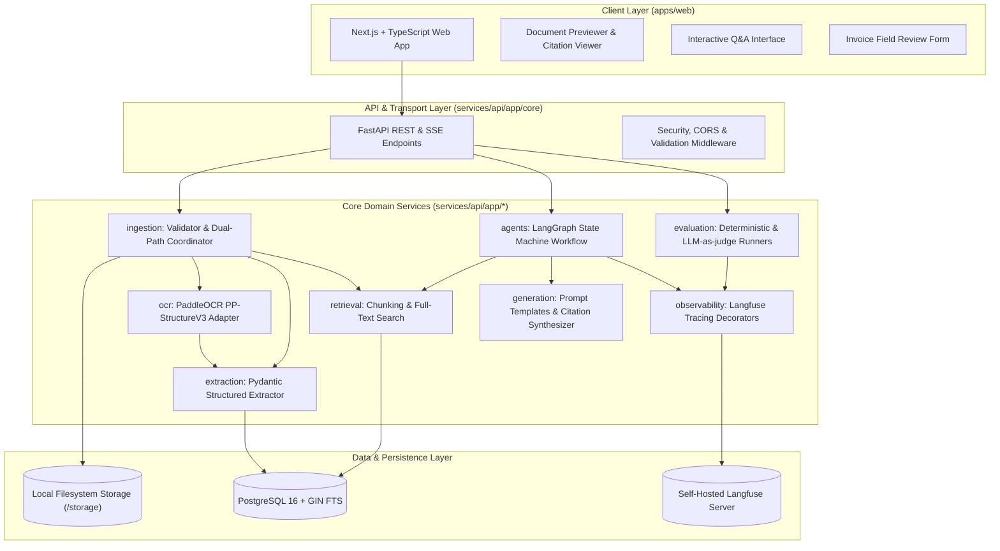

# System Architecture & Technical Specifications

## Project Name
**Multimodal Document Intelligence with Agentic RAG**

## Status
Implemented Through Stage 14 Evaluation and Fail-Safe Observability

---

## 1. Ikhtisar Arsitektur

Sistem dirancang dengan pendekatan arsitektur modular yang memisahkan antarmuka pengguna, orkestrasi pemrosesan AI, PostgreSQL full-text retrieval, provider Muse Spark melalui OpenCode, serta pemantauan siklus hidup AI.

Prinsip utama yang diterapkan adalah **Clean Architecture / Hexagonal Architecture**, di mana modul logika domain bisnis (ekstraksi, OCR, agen, dan evaluasi) sepenuhnya decoupled dari lapisan transport HTTP (FastAPI route handler).



---

## 2. Tanggung Jawab Modul dan Direktori

Struktur repositori diatur secara ketat untuk menjaga keterpisahan tanggung jawab (Separation of Concerns):

```
multimodal-document-intelligence/
├── apps/web/
├── services/api/app/
│   ├── core/
│   ├── db/
│   ├── documents/
│   ├── ingestion/
│   ├── ocr/
│   ├── extraction/
│   ├── retrieval/
│   ├── generation/
│   ├── agents/
│   ├── evaluation/
│   └── observability/
├── services/api/tests/
├── contracts/
├── datasets/samples/
├── datasets/ground-truth/
├── storage/
├── infra/docker/
├── scripts/
└── docs/
```

### 2.1 Rincian Setiap Folder

| Path Direktori | Tanggung Jawab & Cakupan | Larangan / Batasan |
|---|---|---|
| `apps/web/` | Antarmuka pengguna berbasis Next.js dan TypeScript. Menyediakan upload drag-and-drop, viewer dokumen PDF/gambar dengan penanda sitasi visual, formulir inspeksi JSON hasil ekstraksi, dan interface chat Q&A. | Dilarang mengakses database atau memanggil library OCR secara langsung; seluruh komunikasi wajib via REST/SSE API. |
| `services/api/app/core/` | Konfigurasi aplikasi via Pydantic Settings, manajemen environment variables, penanganan exception global, middleware HTTP, dan konstanta keamanan. | Tidak boleh memuat logika bisnis domain invoice atau dependensi OCR. |
| `services/api/app/db/` | Manajemen koneksi database PostgreSQL dan session maker SQLAlchemy async. | Hanya berurusan dengan koneksi database dan base ORM; tidak memuat logika parsing dokumen. |
| `services/api/app/documents/` | Definisi entitas dokumen (`DocumentSession`, `DocumentPage`), siklus hidup status pemrosesan dokumen, dan repository dokumen. | Terisolasi dari HTTP request object. |
| `services/api/app/ingestion/` | Validasi berkas fisik (magic bytes, batas ukuran 15 MB, batas 10 halaman), pembagian halaman PDF, normalisasi gambar, dan orkestrasi jalur ekstraksi (dual-path coordinator). | Tidak melakukan ekstraksi skema field invoice (hanya menyiapkan berkas dan teks mentah). |
| `services/api/app/ocr/` | Integrasi PaddleOCR PP-StructureV3 untuk deteksi layout dokumen, ekstraksi blok teks, dan parsing struktur tabel pada dokumen scanned atau gambar. | Tidak boleh bergantung pada layer HTTP route atau skema response API. |
| `services/api/app/extraction/` | Definisi skema Pydantic Invoice, parsing data teks/tabel menjadi JSON terstruktur, dan validasi deterministik nilai moneter (subtotal + tax = total). | Murni berfokus pada data parsing dan validasi data terstruktur; tidak memanggil database secara langsung. |
| `services/api/app/retrieval/` | Chunking berbasis halaman/tabel dan PostgreSQL full-text search dengan filter `document_id`. | Hanya menangani pemotongan dan penarikan konteks; tidak menyusun jawaban akhir ke pengguna. |
| `services/api/app/generation/` | Penyusunan prompt, sintesis jawaban yang bersumber dari konteks dokumen, pemformatan sitasi halaman, dan aturan abstention ("informasi tidak ditemukan"). | Tidak mengelola koneksi database secara langsung. |
| `services/api/app/agents/` | State machine workflow menggunakan LangGraph: siklus query rewrite, penarikan dokumen, pengecekan kecukupan konteks, dan verifikasi sitasi sebelum diserahkan ke pengguna. | Hanya mengorkestrasikan interaksi komponen domain; tidak memproses payload HTTP secara langsung. |
| `services/api/app/evaluation/` | Evaluation sampling eksplisit: citation match, ranked ID context precision, Hit@K, abstention, latency gate, serta Muse/OpenCode judge untuk faithfulness dan answer correctness saat ground truth tersedia. | Tidak boleh menyebut skor judge sebagai probabilitas kebenaran atau mengarang measured result tanpa run tersimpan. |
| `services/api/app/observability/` | Trace ID, latency node, audit event PostgreSQL, JSONL teredaksi, dan ekspor opsional melalui Langfuse Python SDK v4. | Tidak boleh memblokir alur utama jika Langfuse down; token/cost tetap null bila provider tidak melaporkannya. |
| `services/api/tests/` | Kumpulan automated tests berbasis pytest: unit test modul ingestion, ocr, extraction, retrieval, agent, serta integration test API. | Dilarang memuat kredensial rahasia atau memanggil API eksternal berbayar secara live saat CI. |
| `contracts/` | Definisi skema bersama antara frontend dan backend (OpenAPI specs, JSON schemas terstandarisasi untuk invoice, TypeScript type declarations). | Bebas dari implementasi runtime; hanya memuat kontrak skema. |
| `datasets/samples/` | Kumpulan berkas invoice sintetis atau berlisensi publik bebas PII (PDF, JPG, PNG) untuk pengujian. | Dilarang keras menyimpan dokumen nyata perusahaan atau dokumen yang memuat data pribadi. |
| `datasets/ground-truth/` | Dataset anotasi kebenaran mutlak (golden labels): JSON target ekstraksi per berkas sampel dan pasangan pertanyaan-jawaban emas beserta nomor halaman sitasi. | Hanya memuat data ground-truth yang terverifikasi untuk evaluasi benchmark. |
| `storage/` | Direktori lokal host untuk menampung file upload sementara dan artefak hasil pemrosesan dokumen selama runtime MVP. | Seluruh isinya (kecuali `.gitkeep`) diabaikan oleh git (`.gitignore`). |
| `infra/docker/` | Berkas kontainer FastAPI, Next.js, PostgreSQL, dan Langfuse. | Bebas dari password production atau private key. |
| `scripts/` | Skrip pembantu operasional mandiri: skrip pembuatan data sintetis, skrip inisialisasi database, dan benchmark test runner. | Dijalankan manual via CLI, bukan bagian dari runtime API utama. |
| `docs/` | Dokumentasi arsitektur, spesifikasi kebutuhan produk, alur data, rencana evaluasi, dan model keamanan sistem. | Wajib selalu sinkron dengan kondisi arsitektur terkini. |

---

## 3. Batas Antara Frontend dan Backend (Boundary & Contracts)

Komunikasi antara aplikasi web (`apps/web`) dan layanan backend (`services/api`) diatur melalui batas yang tegas dan formal:

1. **Strict REST & Polling for Status (SSE Limited to Chat Q&A):**
   - Operasi upload berkas, pengambilan metadata dokumen, dan verifikasi status pemrosesan dokumen dilakukan melalui REST API standar (`multipart/form-data` dan `application/json`).
   - Pelacakan status pemrosesan dokumen (validasi -> ekstraksi native / OCR -> parsing struktur -> indexing) diimplementasikan secara **near-real-time status via polling** oleh frontend ke endpoint `GET /api/documents/{id}/status`. Interval polling dikonfigurasi melalui pengaturan aplikasi/environment client, bukan angka yang ditanam permanen (*not hardcoded*). WebSocket secara eksplisit **tidak digunakan** pada tahap MVP untuk menghindari kompleksitas stateful connection.
   - Sesi tanya jawab interaktif dengan agen (Q&A) memanfaatkan Server-Sent Events (SSE) semata-mata untuk streaming token respons dan visualisasi langkah penalaran agen (*thinking/tool steps*) secara responsif.
2. **Tanpa Akses Langsung ke Database atau Engine AI:**
   - Frontend tidak memiliki kredensial atau koneksi langsung ke PostgreSQL, storage folder, OpenCode, maupun engine OCR.
   - Segala operasi data dan analisis wajib melalui gerbang otentikasi/validasi FastAPI.
3. **Single Source of Truth pada Contracts:**
   - Skema payload request dan response didefinisikan secara deklaratif di direktori `contracts/`.
   - Perubahan skema pada Pydantic backend wajib direfleksikan ke skema TypeScript frontend untuk mencegah inkonsistensi tipe data di waktu kompilasi.

---

## 4. Komponen Sistem AI & Domain Detail

### 4.1 Ingestion & Dual-Path Extraction
Sistem memproses dokumen invoice melalui dua jalur yang ditentukan secara deterministik berdasarkan karakteristik berkas:
- **Jalur 1 (Native Digital PDF via `pypdf`):** Berkas PDF digital diinspeksi metadatanya dan diekstrak teks dasarnya menggunakan pustaka `pypdf`. Jika kepadatan teks (*character density*) memadai dan tidak terindikasi sebagai dokumen hasil scan/gambar, teks native langsung diteruskan ke tahap parsing struktur. Jalur ini sangat cepat (< 1 detik per halaman) dan hemat daya komputasi.
- **Jalur 2 (Rendering via `pypdfium2` & OCR Fallback via `PaddleOCR PP-StructureV3`):** Jika berkas merupakan gambar murni (JPG/PNG) atau PDF scan dengan teks sparse/rusak, sistem merender halaman PDF menjadi gambar beresolusi tinggi (300 DPI) menggunakan `pypdfium2`. Selanjutnya, engine `PaddleOCR PP-StructureV3` mendeteksi layout halaman, memisahkan area tabel, dan membaca teks secara optik.
- **Catatan Lingkup Parser:** Pustaka pihak ketiga seperti Docling tidak dimasukkan ke dalam ruang lingkup MVP untuk menjaga kesederhanaan dan fokus pipeline.

### 4.2 Structured Extraction (Pydantic Schema)
Setelah teks mentah dan tabel diperoleh, sistem memetakan informasi dokumen ke skema Pydantic terstruktur:
- `InvoiceMetadata`: Nomor invoice, tanggal terbit, tanggal jatuh tempo, mata uang.
- `VendorInfo` & `BuyerInfo`: Nama entitas, alamat, nomor kontak, NPWP/Tax ID jika ada.
- `LineItem`: Nomor baris, deskripsi produk/jasa, kuantitas, harga satuan, diskon, jumlah total baris.
- `FinancialSummary`: Subtotal, tarif pajak, nilai nominal pajak, biaya pengiriman, total akhir tagihan.
- `Deterministic Validator`: Menjalankan verifikasi logika: `subtotal + pajak + biaya_tambahan - diskon == total_akhir`.

### 4.3 Chunking & Retrieval
- **Hierarchical / Layout-Aware Chunking:** Dokumen tidak dipotong secara buta berdasarkan jumlah karakter semata. Chunking dilakukan dengan mempertahankan integritas halaman dan batas baris tabel logis. Metadata `document_id`, `page_number`, dan `chunk_type` (text vs table) disematkan pada setiap chunk.
- **PostgreSQL Full-Text Search:** Konten chunk diindeks dengan GIN `to_tsvector('simple', content)`. Query memakai `plainto_tsquery`, relevance score, dan filter `WHERE document_id = :current_doc_id` untuk isolasi antar-dokumen.

### 4.4 Agentic Workflow (LangGraph)
Alur penalaran tanya jawab dikontrol oleh state graph LangGraph yang deterministik:
- **Node `rewrite_query`:** Memperbaiki formulasi pertanyaan pengguna agar selaras dengan terminologi faktur (misal: "Berapa potongan harganya?" diubah menjadi "Berapa nominal atau persentase diskon yang tercantum pada invoice?").
- **Node `retrieve_context`:** Menarik top-K chunk relevan dari indeks full-text untuk dokumen aktif.
- **Node `rerank`:** Muse Spark menilai ulang semua kandidat. Adapter menolak ID asing/duplikat, lalu menggabungkan skor retrieval dan skor model secara deterministik.
- **Node `evaluate_sufficiency`:** Memeriksa apakah chunk yang ditarik memuat informasi yang cukup untuk menjawab pertanyaan. Jika tidak memadai, memicu ekspansi query atau pencarian fallback.
- **Node `generate_answer`:** Menyusun respons faktual berdasarkan konteks yang ditarik, lengkap dengan referensi sitasi.
- **Node `verify_citation`:** Memeriksa secara deterministik apakah nomor halaman dan kutipan teks yang dicantumkan benar-benar ada di dalam chunk referensi asli. Jika sitasi tidak valid, agen melakukan koreksi otomatis sebelum mengirim respons ke pengguna.

### 4.5 Observability (Langfuse Self-Hosted)
Setiap RAG run memiliki trace ID dan audit event internal yang tidak bergantung pada Langfuse:
- Mencatat latensi setiap node dan total request.
- Menyimpan event PostgreSQL serta JSONL yang telah melewati redaction.
- Mengekspor trace agent ke Langfuse jika instance dan key dikonfigurasi.
- Menyimpan token sebagai `null` bila OpenCode tidak melaporkan usage; biaya tidak dihitung tanpa data provider.
- Memperlakukan kegagalan Langfuse sebagai non-blocking (`failed`) agar jawaban utama tetap tersedia.

### 4.6 Evaluation Framework
Framework pengujian performa terintegrasi di `services/api/app/evaluation/`:
- Menyimpan satu evaluation batch untuk RAG run yang dipilih pengguna dari halaman audit.
- Menghitung citation match, ranked ID context precision, Hit@K, abstention correctness, dan latency gate secara deterministik.
- Menjalankan Muse/OpenCode LLM-as-judge untuk faithfulness dan answer correctness opsional.
- Memisahkan threshold rancangan dari measured result; baseline penuh tetap memerlukan dataset ground-truth nyata.

---

## 5. Dependency Direction & Strict Boundaries

Arsitektur sistem menerapkan aturan arah ketergantungan (*dependency direction*) yang ketat:

```
[Layer 1: External HTTP / API Routers]
                 │
                 ▼ (bergantung ke bawah)
[Layer 2: Application Orchestration Services]
                 │
                 ▼ (bergantung ke bawah)
[Layer 3: Core Domain Services & Business Rules]
                 ▲
                 │ (Inversion of Control)
[Layer 4: Infrastructure Adapters (DB, OCR Engine, LLM Clients)]
```

### Aturan Keras:
1. **Domain Isolation:** Modul domain (`documents`, `extraction`, `retrieval`, `ocr`, `agents`, `evaluation`) **DILARANG BERGANTUNG** pada modul `services/api/app/core` yang memuat `FastAPI`, `Request`, `Response`, `APIRouter`, atau pustaka web lainnya.
2. **Interface Abstraction:** Modul domain berinteraksi dengan storage, PostgreSQL retrieval, PaddleOCR, dan OpenCode melalui protocol/adapter yang diinjeksikan saat startup.
3. **Penyimpanan Lokal Sederhana:** Modul domain menerima file dalam bentuk stream atau path lokal terabstraksi, bukan berikatan dengan konfigurasi server web tertentu.

---

## 6. Alasan Pemilihan Teknologi (Technology Rationale)

| Komponen | Pilihan Teknologi | Alasan Pemilihan & Keuntungan Arsitektural |
|---|---|---|
| **Web Frontend** | Next.js 14+ & TypeScript | Menyediakan rendering responsif, type safety tingkat tinggi, performa optimal untuk rendering pratinjau PDF di browser, dan ekosistem UI komponen modern. |
| **Backend API Framework** | FastAPI & Pydantic v2 | Performa asinkronus (ASGI) sangat cepat, validasi skema data terintegrasi secara native dengan Pydantic, dokumentasi OpenAPI otomatis, dan ramah terhadap ekosistem library AI Python. |
| **PDF Metadata & Text Parser** | pypdf | Pustaka Python murni yang ringan dan cepat untuk membaca metadata, menghitung jumlah halaman, dan mengekstrak teks native digital tanpa ketergantungan binary berat. |
| **PDF Rasterizer / Renderer** | pypdfium2 | Binding berkinerja tinggi ke engine PDFium untuk merender halaman PDF menjadi gambar berkualitas tinggi (300 DPI) secara cepat saat proses OCR diperlukan. |
| **OCR & Layout Engine** | PaddleOCR PP-StructureV3 | Model open-source unggulan untuk analisis tata letak dokumen (layout analysis) dan pemisahan tabel yang rumit, dapat dijalankan secara lokal/on-premise tanpa biaya per halaman API cloud, serta mendukung CPU fallback. Docling tidak digunakan pada MVP. |
| **Database & Retriever** | PostgreSQL 16 Full-Text Search | Menyatukan metadata, chunk, indeks GIN, dan audit log tanpa model embedding lokal atau vector database tambahan. |
| **RAG Componentry** | LangChain | Menyediakan recursive text splitter untuk chunking yang menjaga batas halaman dan tabel. |
| **Agent Orchestration** | LangGraph | Menyediakan kontrol penuh terhadap siklus penalaran AI berbasis state graph terarah (*cyclic graph*), memungkinkan alur koreksi diri (*self-correction*), query rewrite, dan verifikasi sitasi yang terkontrol dan dapat diprediksi. |
| **Evaluasi AI** | Custom Deterministic Metrics + Muse Judge | Metrik eksak tidak memerlukan LLM; semantic faithfulness/correctness memakai structured judge melalui provider online yang sama. Ragas 0.4.3 dikeluarkan setelah konflik dependency terverifikasi agar tidak merusak LangGraph runtime. |
| **Observability Platform** | Internal Audit + Langfuse Exporter | PostgreSQL/JSONL menyediakan audit minimum yang selalu aktif. Langfuse dapat di-host mandiri dan menerima agent trace saat key tersedia; token/cost tidak diestimasi tanpa usage resmi provider. |
| **Penyimpanan Berkas** | Local Filesystem Storage | Menjaga kesederhanaan arsitektur tahap MVP tanpa ketergantungan pada layanan cloud storage berbayar (AWS S3/GCS); dienkapsulasi dalam antarmuka storage adapter sehingga mudah dimigrasi ke S3 di masa mendatang. |
| **Kontainerisasi** | Docker & Docker Compose | Menjamin konsistensi environment untuk PostgreSQL, aplikasi, dan server Langfuse. |
| **Testing Framework** | pytest & pytest-asyncio | Standar de-facto pengujian di ekosistem Python, mendukung pengujian asinkronus untuk endpoint FastAPI dan pipeline AI. |
| **Continuous Integration** | GitHub Actions | Otomatisasi pengujian kualitas kode, linting, validasi tipe data, dan eksekusi regression test pada setiap pull request. |

---

## 7. Open Questions (Keputusan Arsitektur Terbuka)

Keputusan berikut dicatat secara terbuka dan tidak dipilih secara sepihak untuk menghindari keterikatan pada layanan berbayar atau asumsi perangkat keras tanpa validasi:

1. **Model LLM Production:**
   - Stage 9 memakai Muse Spark melalui OpenCode untuk development. Provider dengan SLA dan kebijakan data yang sesuai masih harus dipilih sebelum deployment production.
2. **Mode Deployment Privasi (Local Mode vs. External-Provider Mode):**
   - Apakah target instalasi default difokuskan pada Local Mode murni (seluruh AI berjalan on-premise tanpa koneksi internet keluar) atau External-Provider Mode dengan izin eksplisit pengguna (*user consent*)?
3. **Dense Retrieval Opsional:**
   - Apakah versi berikutnya perlu menambahkan embedding cloud sebagai hybrid retrieval setelah baseline full-text dievaluasi?
4. **Pilihan Model Reranking:**
   - Apakah reranking online memberi peningkatan kualitas yang cukup dibanding biaya dan latensi tambahannya?
5. **Durasi Retensi Dokumen (Retention Duration):**
   - Berapa lama dokumen sesi disimpan sebelum dibersihkan otomatis oleh sistem (misal: 1 jam, 24 jam, atau pembersihan seketika setelah sesi ditutup oleh pengguna)?
6. **Spesifikasi Lingkungan Benchmark Hardware:**
   - Apa spesifikasi referensi standar (jumlah core vCPU, RAM, dan ketersediaan GPU NVIDIA) yang disepakati untuk mengukur dan merevisi target latensi provisional?
