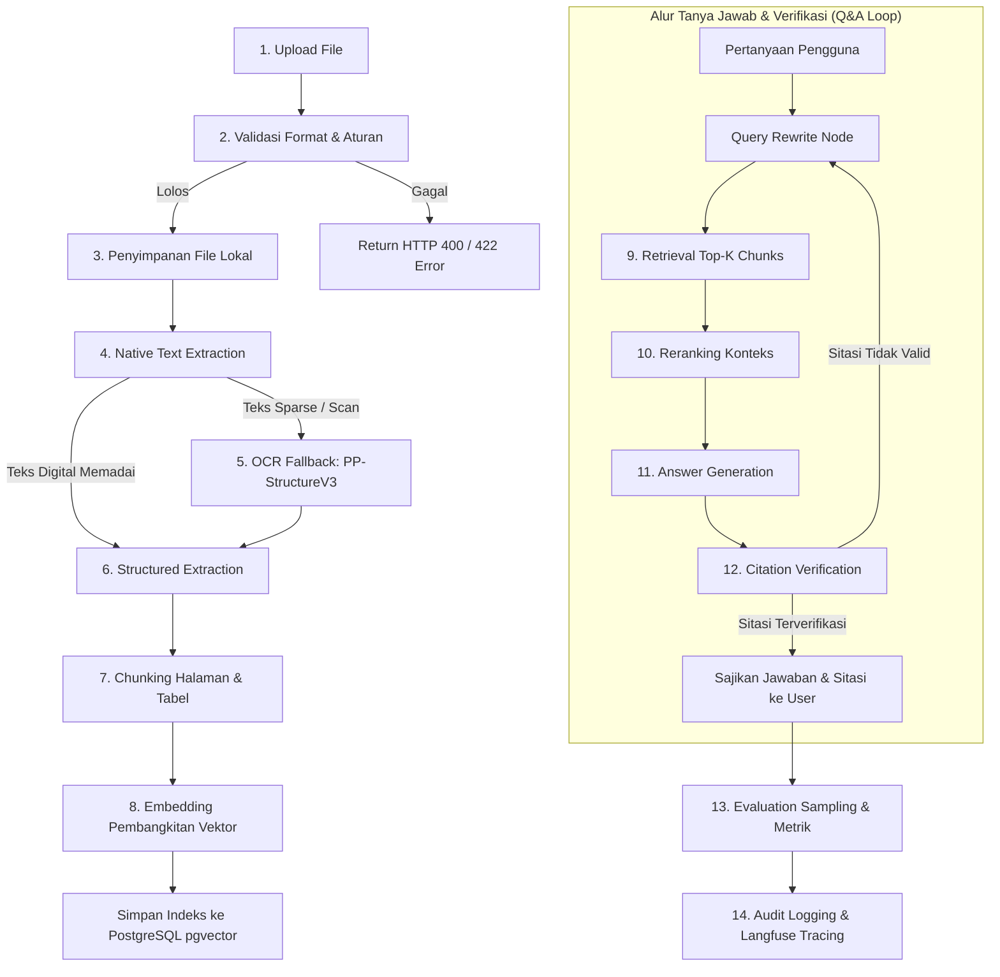

# Data Flow & Pipeline Specification

## Project Name
**Multimodal Document Intelligence with Agentic RAG**

## Status
Partially Implemented: Upload, Validation, Local Storage, and Document Metadata

---

## 1. Diagram Alur Data End-to-End

Berikut adalah representasi alur data lengkap dari saat pengguna mengunggah dokumen invoice hingga jawaban diverifikasi, dievaluasi, dan dicatat dalam log audit sistem:

---

## 2. Rincian Alur Setiap Tahap

---

### Tahap 1: Upload (Unggah Berkas)
- **Deskripsi:** Pengguna memilih atau menarik berkas invoice (PDF, JPG, PNG) melalui antarmuka web dan mengirimkannya sebagai payload HTTP `multipart/form-data`.
- **Input:** Berkas biner (`UploadFile` stream) dan parameter sesi opsional dari client.
- **Output:** Temporary memory buffer berkas biner di memori API server.
- **Kemungkinan Gagal:**
  - Koneksi internet terputus di tengah proses transmisi berkas.
  - Ukuran berkas melampaui batas payload HTTP web server sebelum mencapai controller.
  - Payload form-data rusak (*corrupted stream*).
- **Data yang Disimpan:** Tidak ada data persisten yang disimpan pada tahap ini (berkas masih berada di buffer sementara).

---

### Tahap 2: Validasi (Format, Header & Kebijakan)
- **Deskripsi:** Melakukan pemeriksaan ketat terhadap keaslian format berkas dan kepatuhan batasan MVP sebelum berkas diproses lebih lanjut. Untuk berkas PDF, `pypdf` digunakan untuk inspeksi metadata cepat dan penghitungan jumlah halaman tanpa merender seluruh isi.
- **Input:** Temporary buffer berkas biner.
- **Output:** Metadata validasi terverifikasi (MIME type tervalidasi, ekstensi berkas yang sah, ukuran byte, jumlah halaman untuk PDF).
- **Kemungkinan Gagal:**
  - *Extension Spoofing:* Berkas executable (.exe) atau skrip berbahaya yang diubah namanya menjadi `.pdf` (ditolak oleh verifikasi magic bytes).
  - *Size Exceeded:* Ukuran berkas melebihi batas maksimal 15 MB.
  - *Page Exceeded:* Jumlah halaman dokumen PDF melebihi batas maksimal 10 halaman.
  - *File Corruption:* Berkas biner rusak sehingga header PDF tidak dapat di-parse oleh parser.
- **Data yang Disimpan:** Log peristiwa validasi (sukses atau alasan penolakan beserta kode error).

---

### Tahap 3: Penyimpanan File (File Persistence)
- **Deskripsi:** Berkas yang lolos validasi disimpan ke dalam direktori penyimpanan lokal terisolasi dengan nama berkas acak yang aman.
- **Input:** Buffer berkas biner tervalidasi, nama berkas asli, ekstensi berkas.
- **Output:** ID Dokumen unik (`document_id` berbasis UUIDv4), path absolut penyimpanan lokal (`/storage/<uuid>.<ext>`), dan timestamp penyimpanan.
- **Kemungkinan Gagal:**
  - Kapasitas disk lokal penuh (*disk out of space*).
  - Masalah izin akses sistem operasi (*permission denied*) pada folder `/storage/`.
  - Terjadi race condition saat pembuatan path berkas.
- **Data yang Disimpan:**
  - File fisik disimpan di disk lokal: `storage/{document_id}.{ext}`.
  - Baris baru pada tabel database `documents` (id, original_filename, stored_path, mime_type, file_size_bytes, page_count, status="STORED", created_at). Perubahan status dapat dipantau frontend melalui near-real-time status via polling ke endpoint `GET /api/documents/{id}/status`.

---

### Tahap 4: Native Text Extraction (`pypdf`)
- **Deskripsi:** Membaca metadata dan teks langsung dari berkas PDF menggunakan pustaka `pypdf` untuk setiap halaman. Pustaka Docling tidak digunakan pada MVP.
- **Input:** Berkas PDF dari `stored_path`.
- **Output:** Kumpulan teks native per halaman dan skor kepadatan teks (*character density ratio*).
- **Kemungkinan Gagal:**
  - Dokumen berupa file gambar (JPG/PNG) sehingga tahap ini dilewati (*skip* langsung ke Tahap 5).
  - PDF terenkripsi atau membutuhkan password pembuka (*password-protected*).
  - PDF berisi teks rusak atau font encoding tidak standar (*garbled characters / CID font issues*).
- **Data yang Disimpan:** Objek ekstraksi sementara di memori; pembaruan status dokumen menjadi "NATIVE_PARSED" atau "NEEDS_OCR".

---

### Tahap 5: Rendering (`pypdfium2`) & OCR Fallback (`PaddleOCR PP-StructureV3`)
- **Deskripsi:** Dijalankan secara otomatis apabila berkas berupa gambar murni atau halaman PDF memiliki rasio teks native yang sangat rendah (indikasi dokumen hasil scan foto/kamera). Halaman PDF di-render menjadi gambar 300 DPI menggunakan `pypdfium2`. Selanjutnya, engine `PaddleOCR PP-StructureV3` mendeteksi tata letak dokumen, area paragraf, dan struktur tabel.
- **Input:** Gambar halaman (di-render ke format gambar RGB 300 DPI dari PDF scan menggunakan `pypdfium2`, atau berkas gambar asli JPG/PNG).
- **Output:** Teks hasil pengenalan optik, koordinat bounding box setiap baris teks, deteksi blok tabel dalam format HTML/struktur sel (baris, kolom, header).
- **Kemungkinan Gagal:**
  - Gambar terlalu buram (*low resolution / out-of-focus*), terdistorsi, atau terpotong sehingga teks tidak terbaca.
  - *Out of Memory (OOM)* pada worker jika resolusi gambar terlalu besar dan diproses pada CPU berkapasitas terbatas.
  - Model gagal mengenali garis batas tabel yang tidak memiliki batas visual tegas (*borderless tables*).
- **Data yang Disimpan:**
  - Teks hasil OCR per halaman dan struktur tabel disimpan pada tabel database `document_pages` (page_number, extracted_text, layout_json, extraction_method="OCR_PADDLE").
  - Pembaruan status dokumen menjadi "TEXT_EXTRACTED" (dapat diakses frontend via polling status).

---

### Tahap 6: Structured Extraction (Pydantic Invoice Schema)
- **Deskripsi:** Memproses teks terintegrasi dan struktur tabel menggunakan LLM yang dipandu oleh skema Pydantic terstandarisasi untuk menghasilkan representasi JSON invoice yang bersih.
- **Input:** Gabungan teks dokumen per halaman dan representasi tabel terstruktur dari tahap sebelumnya.
- **Output:** Objek JSON tervalidasi yang memenuhi skema Pydantic `InvoiceData`:
  - Nomor invoice, tanggal terbit, tanggal jatuh tempo.
  - Informasi vendor dan pembeli.
  - Array daftar item (*line items*): deskripsi, kuantitas, harga satuan, jumlah.
  - Ringkasan finansial: subtotal, pajak, biaya lain, total akhir.
- **Kemungkinan Gagal:**
  - LLM menghasilkan field yang tidak sesuai tipe data skema (misal string pada field numerik float).
  - Gagal verifikasi aturan deterministik: `subtotal + pajak != total_akhir` melampaui batas toleransi pembulatan.
  - *Rate limit* atau *timeout* saat memanggil LLM provider.
- **Data yang Disimpan:**
  - Baris baru pada tabel database `invoice_extractions` (document_id, extraction_json, is_math_valid, validation_errors, raw_llm_response, created_at).
  - Pembaruan status dokumen menjadi "STRUCTURE_EXTRACTED".

---

### Tahap 7: Chunking (Layout & Page-Aware)
- **Deskripsi:** Memecah teks dokumen menjadi potongan-potongan logis (*chunks*) tanpa memecah entitas tabel di tengah baris, dengan mempertahankan konteks nomor halaman.
- **Input:** Teks dokumen per halaman dan blok tabel dari Tahap 4 & 5.
- **Output:** Daftar chunk teks terstruktur. Setiap chunk memiliki atribut: `chunk_id`, `document_id`, `page_number`, `chunk_type` ("TEXT" / "TABLE"), `content`, dan `token_count`.
- **Kemungkinan Gagal:**
  - Tabel yang sangat panjang melebihi batas ukuran maksimal satu chunk (*token window overflow*).
  - Karakter khusus yang memicu kegagalan pada fungsi text-splitter.
- **Data yang Disimpan:** Record potongan teks sementara yang siap di-embedding.

---

### Tahap 8: Embedding Generation & Vector Indexing
- **Deskripsi:** Menghitung representasi vektor numerik (*dense embedding*) untuk setiap chunk teks menggunakan model embedding terstandarisasi, kemudian menyimpannya ke tabel PostgreSQL yang dilengkapi ekstensi pgvector.
- **Input:** Daftar chunk teks dari Tahap 7.
- **Output:** Vektor embedding berdimensi tetap (misal: 1536 dimensi atau sesuai model embedding yang dipilih).
- **Kemungkinan Gagal:**
  - Error koneksi ke layanan embedding model.
  - Ketidaksesuaian dimensi vektor antara model embedding dengan konfigurasi kolom pgvector.
- **Data yang Disimpan:**
  - Baris pada tabel `document_chunks` di PostgreSQL (id, document_id, page_number, chunk_type, content, embedding_vector, created_at).
  - Indeks vektor HNSW / IVFFlat diperbarui.
  - Status dokumen diperbarui menjadi "INDEXED_READY".

---

### Tahap 9: Retrieval (Penarikan Konteks Terfilter)
- **Deskripsi:** Pengguna mengirimkan pertanyaan seputar dokumen. Query di-rewrite oleh agent, di-embedding, dan dicari kecocokannya dengan chunk dokumen menggunakan cosine distance pada pgvector dengan isolasi dokumen aktif.
- **Input:** Query teks hasil penulisan ulang (*rewritten query*), `document_id` aktif, dan parameter `top_k` (default: 5).
- **Output:** Kumpulan top-K chunk teks beserta skor kemiripan (*similarity score*) dan metadata nomor halaman.
- **Kemungkinan Gagal:**
  - Tidak ada chunk yang memenuhi ambang batas kemiripan minimal (*low similarity threshold*).
  - Salah menerapkan filter `document_id` sehingga terjadi kebocoran konteks antar-dokumen (dicegah oleh query parameter wajib).
- **Data yang Disimpan:** Jejak pencarian (query, retrieved chunk IDs, similarity scores) dicatat di memori sesi LangGraph dan tracer Langfuse.

---

### Tahap 10: Reranking
- **Deskripsi:** Memberi skor ulang terhadap kumpulan top-K chunk yang ditarik dari pgvector menggunakan model reranker (cross-encoder) untuk menyaring potongan teks yang paling relevan secara semantik terhadap pertanyaan finansial spesifik.
- **Input:** Query pengguna dan top-K chunk kandidat dari Tahap 9.
- **Output:** Daftar chunk terurut ulang (*reranked chunks*) berdasarkan relevansi semantik tertinggi.
- **Kemungkinan Gagal:**
  - Latensi tambahan jika model reranker berukuran besar diproses pada CPU.
  - Format output skor reranker tidak valid atau bernilai null.
- **Data yang Disimpan:** Skor reranking per chunk disimpan di trace Langfuse untuk analisis perbandingan relevansi retrieval.

---

### Tahap 11: Answer Generation
- **Deskripsi:** LLM menyintesis jawaban yang lugas dan tepat berdasarkan konteks yang ditarik dari dokumen. Jika konteks tidak memuat jawaban, model wajib melakukan abstention ("Data tidak tercantum dalam dokumen"). Setiap klaim fakta wajib dilampiri penanda sitasi `[Hal X: "Kutipan"]`.
- **Input:** Prompt sistem yang ketat, pertanyaan pengguna, dan teks dari chunk hasil reranking.
- **Output:** Teks jawaban sementara beserta daftar sitasi terstruktur (nomor halaman dan kutipan teks rujukan).
- **Kemungkinan Gagal:**
  - Model berhalusinasi informasi di luar konteks yang diberikan.
  - Model gagal menyertakan format sitasi yang diminta (*citation syntax error*).
  - *Context window limit* terlampaui jika jumlah chunk terlalu besar.
- **Data yang Disimpan:** Respons mentah LLM disimpan pada state graph LangGraph.

---

### Tahap 12: Citation Verification (Verifikasi Sitasi Deterministik)
- **Deskripsi:** Node pemeriksa pada LangGraph memverifikasi secara deterministik apakah kutipan teks yang dicantumkan oleh model benar-benar terdapat pada halaman dokumen yang dirujuk.
- **Input:** Teks jawaban, daftar sitasi (halaman dan teks kutipan), dan teks asli halaman terkait dari database `document_pages`.
- **Output:** Status verifikasi (`is_verified: true/false`), daftar sitasi yang valid, dan koreksi jawaban jika ada sitasi yang salah.
- **Kemungkinan Gagal:**
  - Model melakukan paraphrase pada kutipan teks sehingga pencarian exact string match gagal (ditangani dengan normalisasi spasi dan toleransi fuzzy matching terkontrol).
  - Model merujuk ke nomor halaman yang tidak ada dalam dokumen.
- **Data yang Disimpan:**
  - Riwayat tanya jawab tersimpan pada tabel `chat_messages` (id, session_id, document_id, role, content, citations_json, is_citation_verified, created_at).

---

### Tahap 13: Evaluation Sampling
- **Deskripsi:** Sampel interaksi tertentu dievaluasi secara otomatis menggunakan suite pengujian evaluasi (menghitung kesesuaian sitasi, faithfulness via Ragas, dan kebenaran jawaban pada dataset ground-truth).
- **Input:** Pasangan (Pertanyaan, Konteks yang Ditarik, Jawaban yang Dihasilkan, Sitasi, Ground Truth opsional).
- **Output:** Skor metrik evaluasi numerik (Faithfulness, Answer Correctness, Context Precision, Citation Match).
- **Kemungkinan Gagal:**
  - Kegagalan API evaluator LLM-as-judge jika terjadi timeout atau kuota habis.
- **Data yang Disimpan:** Baris pada tabel `evaluation_runs` (id, document_id, metric_name, score, evaluation_type, metadata_json, created_at).

---

### Tahap 14: Audit Logging & Tracing
- **Deskripsi:** Mengirimkan seluruh jejak siklus hidup pemrosesan dokumen dan sesi Q&A ke server Langfuse self-hosted untuk observability, serta mencatat log audit ke sistem log internal dengan penyaringan data sensitif (redaction).
- **Input:** Trace context, event name, latency timer, token count, error stack trace (jika ada), payload log.
- **Output:** Konfirmasi penerimaan trace oleh Langfuse (`trace_id`) dan penulisan baris log terstruktur (JSON format) di file log server.
- **Kemungkinan Gagal:**
  - Server Langfuse lokal sedang tidak aktif/down (sistem utama tetap berjalan normal / fail-safe).
  - Buffer log internal penuh.
- **Data yang Disimpan:**
  - Jejak lengkap (*trace trees*) di server Langfuse.
  - Berkas log audit terenkripsi/terproteksi di sistem operasi dengan nomor rekening atau data finansial tersensor.
